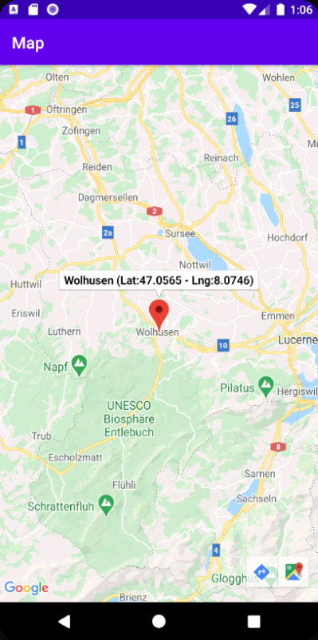

# CAS-DAR_MWS-IPGeolocation

Ce repository contient les sources du projet "IP Localisation" réalisé dans le cadre du CAS-DAR MSW 2020.

La présentation "0_Présentation - IP-Locator.ptx" explique en détails les fonctionnalités. 
Voici ci-dessous un résumé.

- [Description de l'application](#description-application)
- [Fonctionnalités de l'application](#fonction-application)
- [Remarques sur le projet](#remarques-projet)

# Description de l'application
L'application "Citizen engagement" permet en fonction d'une adresse IP fournie de recevoir en retour des informations de localisation de cette adresse IP.

L'application utilise l'API suivante https://ip-api.com/ qui retourne les informations relatives à une adresse IP sous différents formats (XML, CSV, PHP, JSON). Pour notre cas, le format JSON est choisi. 

Plusieurs informations sont renvoyées par l’API et des options sont disponibles, notamment :
* Liste des valeurs désirées en retour
* Langues pour les informations localisées (nom des pays, ..)

<a href="#top">Retour en haut de la page</a>

# Fonctionnalités de l'application
L'application permet de réaliser quelques opérations autour de cette adresse IP et des informations reçues en retour de l'API.

* Fournir une adresse IP 
* Contacter l’API pour recevoir les informations liées à cette adresse IP
* Affichage des données reçues sous forme de liste
* Affichage de l’emplacement géographique sur une carte avec un marqueur
* Gestion d’une liste d’adresses IP (avec un commentaire) pour utilisation ultérieure.
* Choix de la langue (nom des villes)

<a href="#top">Retour en haut de la page</a>

# Remarques sur le projet
* Projet intéressant permettant de mettre en pratique la théorie expliquée durant les cours MWS.
* On constate qu’il y a plusieurs méthodes pour effectuer certaines opérations, avec des avantages et inconvénients pour chacune. Difficile de choisir la bonne méthode dès le début.
* La mise en place des « layout » demande de la pratique pour bien maîtriser les possibilités (Linear, Constraint,...)

<a href="#top">Retour en haut de la page</a>

